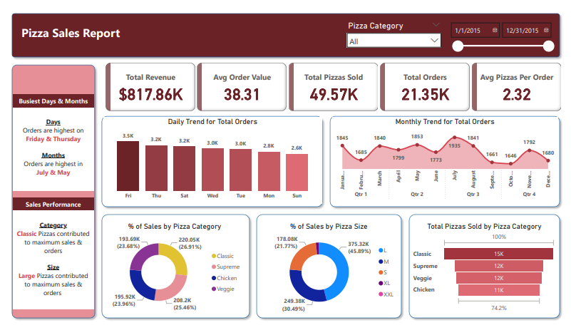
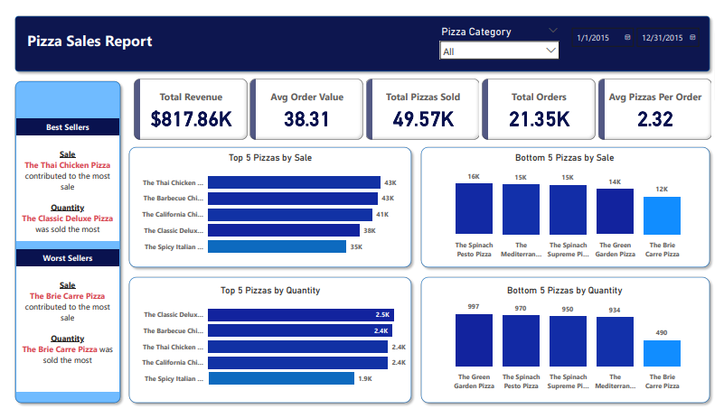

# 📊 Pizza Sales Report - Data Analysis

## 🖼️ Demo

## 🔍 Deducted KPIs from the dataset:
- Total Revenue  
- Total Orders  
- Total Pizzas Sold  
- Average Order Value  
- Average Pizzas per Order  

## 📈 Generated Sales Trends:
- **Total Orders per Day & Month:**  
  - Orders peak on certain weekdays  
  - Highest orders recorded in specific months  

- **Percentage of Sales by Pizza Category & Size:**  
  - Classic pizzas contributed the most to sales  
  - Large-sized pizzas had the highest contribution  

- **Total Pizzas Sold by Pizza Category:**  
  - Classic, Supreme, Veggie, and Chicken pizzas were the best performers  

- **Busiest Time of the Day & Month:**  
  - Orders increased towards the end of the week  
  - Certain months had significantly higher sales  

- **Top & Bottom 5 Pizzas by Sale:**  
  - Some pizzas consistently outsold others  
  - The least-selling pizzas had significantly lower demand  

- **Top & Bottom 5 Pizzas by Quantity:**  
  - Some pizzas were ordered in higher quantities  
  - Certain pizzas had the lowest sales volume  

## 🔥 Key Takeaways:
- **Marketing Strategy:** Focus promotions on high-sales days.  
- **Inventory Optimization:** Stock more large-sized & best-selling pizzas.  
- **Seasonal Offers:** Target high-sales months for special promotions.  

This analysis was performed using **Power BI**, showcasing key metrics and trends for optimizing business decisions.  
